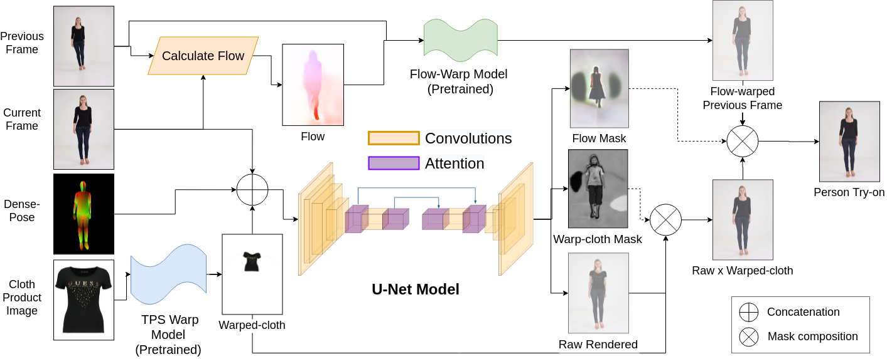
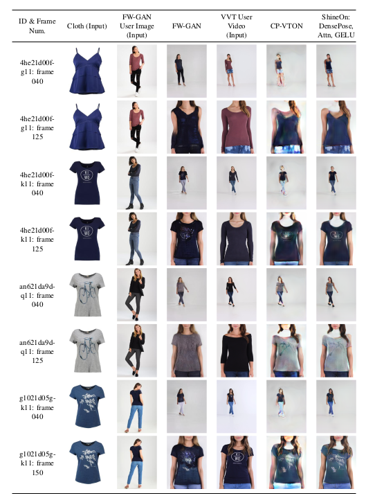
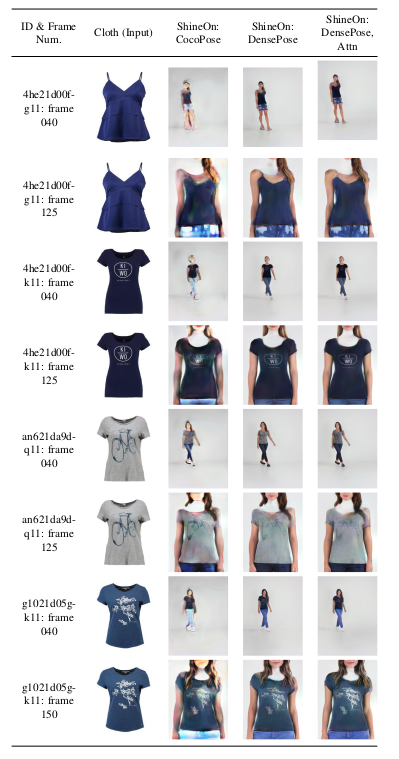
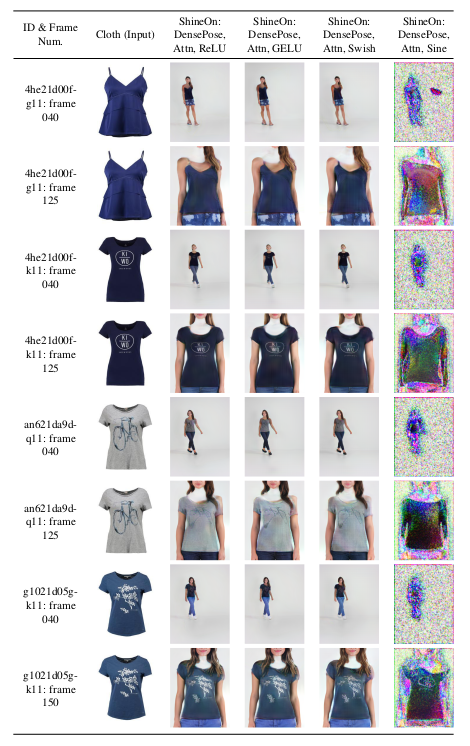
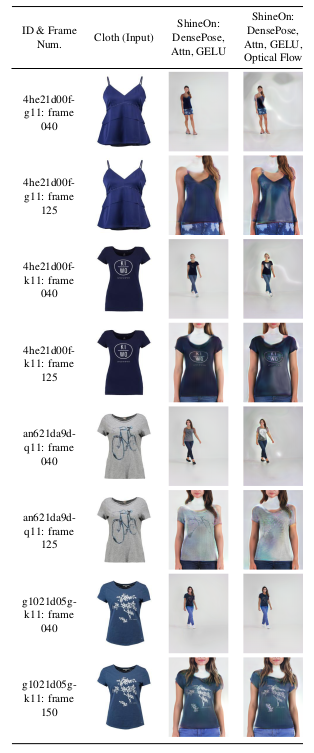

# ShineOn: Illuminating Design Choices for Practical Video-based Virtual Clothing Try-on

[ [Paper](https://arxiv.org/abs/2012.10495) ] [ [Project Page](https://gauravkuppa.github.io/publication/2021-01-09-shine-on-1) ]

This repository contains the code for our paper accepted at the 
Generation of Human Behavior Workshop at WACV 2021.

Key Contributions:
- Scientific experiments built from the ground-up to isolate effects of each method
- Empirically show DensePose results in better quality than CocoPose
- Add self-attention layers
- Find that GeLU show best results

## Architecture Overview

## How To Use This Repository
The point of entry of this repository is `train.py` and `test.py`. We have organized
our code into these main folders: `datasets`, `models`, and `options`.

The `datasets` folder contains several custom defined datasets. To create your own custom tryon dataset,
please refer to the Documentation IV below.

The `models` folder contains several models, such as the warp model and U-Net model
that we used during virtual try-on work. Inside the `networks` sub-folder, we include several
utility networks that we make use of.

The `options` folder contains several of the options we use at train and test time.
These options allows our code to flexible, and run experiments easily.

## Documentation
- [**I. Installation and Data**](docs/1_installation_and_data.md)
- [**II. Inference**](docs/2_inference.md)
- [**III. Train**](docs/3_train.md)
- [**IV. Custom Datasets**](docs/4_custom_tryon_dataset.md)

## Results

### Qualitative Comparison with FW-GAN and CP-VTON

### Qualitative Comparison of Pose and Self-Attention

### Qualitative Comparison of Activation Functions

### Qualitative Comparison of Optical Flow

### Acknowledgements and Related Code
- This code is based in part on Sergey Wong's stellar [CP-VTON](https://github.com/sergeywong/cp-vton) repository. Thank you very much,
Sergey, for your hard work.
- Thank you Haoye Dong and his team for hosting the VUHCS competition at CVPR 2020, 
providing the VVT Dataset, and giving access to the FW-GAN reference code.
- Thank you NVIDIA's team for their work on [Vid2Vid](https://github.com/NVIDIA/vid2vid) and [FlowNet2](https://github.com/NVIDIA/flownet2-pytorch).
- Credits to David Park's [Self-Attention GAN](https://github.com/heykeetae/Self-Attention-GAN) implementation for attention layers reference.
- Credits to Self-Corrective Human-Parsing for easy parsing of LIP clothing labels.
- Credits to the [detectron2 repository](https://github.com/facebookresearch/detectron2) for Densepose annotations.
